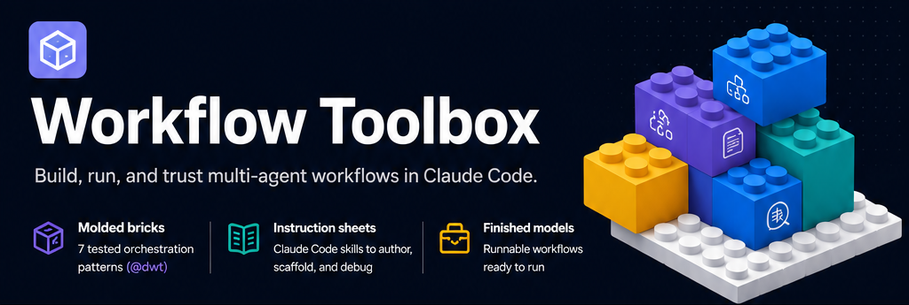
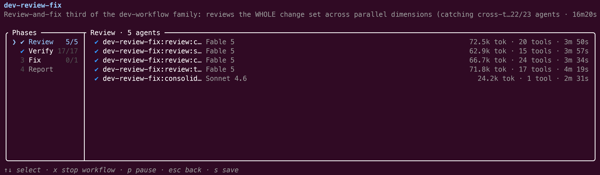
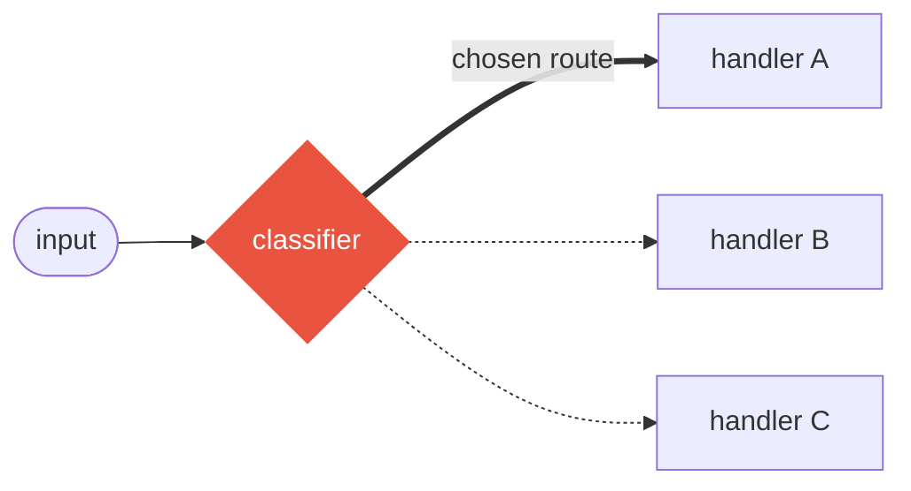
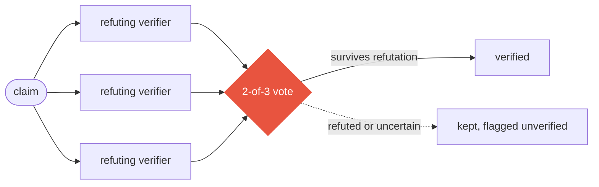
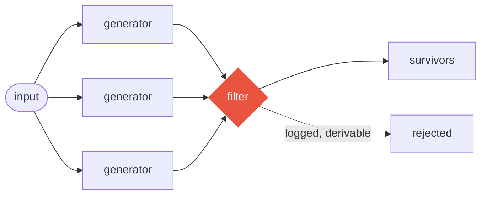
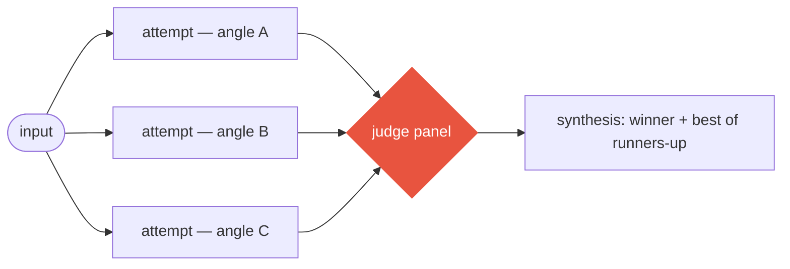
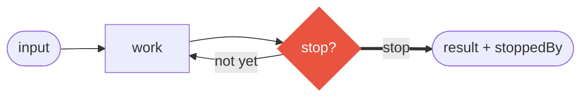
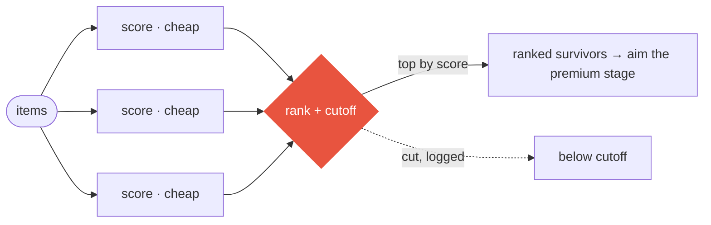
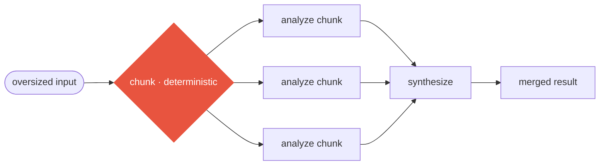

<h1 align="center">
  
</h1>

**Workflow Toolbox is the proportionate agent-orchestration scale for
Claude Code.** Pick the right rung for the task in front of you — a single
agent, a team of agents, a pilot, an orchestrator, or a deterministic
workflow. Most tasks want a low rung; the toolbox exists for the work that
genuinely earns a higher one.

## The orchestration scale

| Rung | What it is | Reach for it when |
|------|------------|-------------------|
| **Plain agent** | One Claude Code subagent, one context. | The task is self-contained. |
| **A team of agents** | A few agents messaging each other. | The work splits into a couple of coordinated roles. |
| **Pilot** | One agent drives a whole unit of work end-to-end — intake → plan → do → verify → report — escalating only when it must. | You want one card or ticket carried autonomously. |
| **Orchestrator** | One agent spawns and arbitrates a wave of pilots. | Several coupled units must move at once. |
| **Deterministic workflow** | A JavaScript script owns the loops, branches, and fan-out; only the leaf `agent()` calls think, each in a fresh context. | The work fans out, needs independent verification, or is too big for one context window. |

**You don't write any of this by hand.** You ask Claude in plain language, and
the shipped skills compose the right rung for you — describe a process in a
sentence and the `workflow-composer` skill writes the workflow; ask to drive a
card end-to-end and the `pilot-wave` skill composes the briefed pilot. What
comes back is plain JavaScript you can read, keep, and edit — a starting point,
not a black box.

The first two rungs are Claude Code's own native primitives — the toolbox
does not reinvent them. What it adds is the higher rungs (the shipped pilot
and orchestrator agents, and the deterministic Workflow-tool patterns) and
the discipline to choose the right rung instead of always reaching for the
biggest one.

## You may already be orchestrating — without the scaffolding

**The skill-chainer.** Your `.claude/commands/*.md` files or skills form a
multi-step procedure that the model must re-read and faithfully re-obey on
every run. Make the steps a `pipeline` in code and only the leaf calls
think — no step is silently skipped under context pressure.

**The Karpathy-style loop.** Make one change, run a check, keep it if a
number improves else `git revert`, append a row to a TSV, repeat. A `/loop`
command or a shell `while` can drive the re-invocation — but the body of
each iteration (what to change, what to keep, when to stop) is still prose
the model re-obeys every time. In `loopUntilDone` your existing verification
command stays the external, deterministic oracle, the stop condition is
typed, and the whole body is code, not just the trigger.

**The executor/supervisor graph.** An executor advances the work and
rewrites a shared `ledger.md`; a fresh-context supervisor re-checks the
claimed progress and appends one-way corrections to `directives.md`. The same
split maps onto two shipped roles — a pilot that drives the work and a
read-only watchdog that observes it — where the supervisor's fresh context is
a property each new sub-agent has by construction, and the watchdog's
read-only stance is a tool fence rather than an instruction it must keep
choosing to obey, with a live DAG to watch if you want one.

All three lean on the model faithfully re-obeying written prose on every
invocation; making the orchestration deterministic code removes that whole
class of drift.

## Why explicit, code-driven orchestration

Markdown loops and file-based graphs both ask the model to re-apply a
written procedure at each invocation. When context grows or attention
shifts, a step can quietly disappear without the procedure itself changing.
Code-driven orchestration moves that control flow into JavaScript: the code
drives fresh-context sub-agents, the model handles only the leaf judgment,
and the loops, branches, barriers, and stop conditions keep their declared
shape. The skipped-a-step drift class leaves the orchestration layer.

The other payoffs follow from that structure:

- A live phase → agent DAG in the **Workflow Observatory** companion, so a
  run is inspectable while it moves.
- Typed resume and cache state across process boundaries.
- Per-role model and cost routing — cheap workers where they suffice, strong
  judges where judgment matters.
- Genuine cross-family decorrelation for verification: a different model
  family, not merely a fresh context on the same model.


*A real `coverage-audit` run replayed in Workflow Observatory (Permafrost theme):
the phase-to-agent DAG on the left, and claim 24's refute-first adversarial vote —
3 of 3 verifiers confirmed — on the right.*

The numbers behind these are
[one click down](docs/public/cost-engineering.md), each with its scope and
methodology attached.

## It won't — and shouldn't — replace everything

The frame is *the right rung*, never "replace everything."

**Keep your skills exactly where they are the right tool.** A well-scoped
skill or a single prompt is often the correct rung; wrapping it in a
workflow is over-engineering.

A **quest-shaped task** does not need a second orchestration loop either: one
well-specified goal with a reproducible verifier is already served by a plain
agent — or by your host's own goal primitive. Naming when *not* to
orchestrate is part of the honesty.

**Human judgment between steps stays yours.** Deterministic orchestration
fixes the declared control flow; it does not decide which tradeoffs you
should make.

And if you ever do convert an implicit setup, that change is proposed and
consent-based — never forced at install, the same shape as the shipped
`adopt-rules` skill: detection → proposal → your consent → conversion.

## Where to go from here

The practitioner depth below is unchanged — here is the map:

- [When should I use a workflow?](#when-should-i-use-a-workflow) — the
  token/spawn honesty and the industry-agnostic shapes.
- [Install the plugin](#install-the-plugin) and
  [Quickstart](#quickstart) — running your first workflow.
- [The nine patterns at a glance](#the-nine-patterns-at-a-glance) — the
  molded bricks and when to use each.
- [The dev-workflow family](docs/public/dev-workflow.md) and
  [the architecture](docs/public/architecture.md) — the full development
  cycle and the design principles, with the measured run numbers.

**Measured, not promised.** Every claim in this section traces to a journaled
production run on this repository or to a public commit — per-agent token and
tool-call counts, dropped-item tallies — auditable after the fact on the
machine that ran them with `npx workflow-toolbox report <runId>`.

**Workflow Toolbox** is a free Claude Code plugin plus the `@workflow-toolbox`
npm packages: nine tested orchestration patterns for Claude Code's **Workflow
tool** (research preview), skills to author, scaffold, and debug workflows, and
twenty-five runnable example compositions — including a full dev pipeline
(ground → plan → implement → review-fix).

What the journals show:

- **Quality** — adversarial review sweeps caught **22 verified findings**
  ([sweep 1](https://github.com/home-dev-lab/workflow-toolbox/commit/ddad93d),
  [sweep 2](https://github.com/home-dev-lab/workflow-toolbox/commit/175feb7)) on
  code whose quality gates (tests + typecheck + lint) were already green.
  Among them: a literal NUL byte written into a file by a previous run's fixer
  agent, and a revert path that, fed an empty SHA by an agent self-report,
  would degrade to a bare `git reset --hard` and silently keep the bad merge.
  Fresh-context reviewers see what the author's context cannot.
- **Cost** — the verification stage of the shipped dev workflows dropped
  **−50.1% tokens run-over-run** while reviewing a *larger* diff (−25.1% per
  verification vote × one-third fewer votes; severity-gated voting alone cut
  the Verify phase −47%, run `wf_bc8dd6fd-167`). The measured principle behind
  every lever: agent cost follows **tool calls**, not prompt size —
  [full methodology](docs/public/cost-engineering.md).
- **Honesty** — negative results are published too: a token-compression proxy
  experiment *increased* weighted cost **+51%** and was rejected — see
  [what we deliberately did NOT do](docs/public/cost-engineering.md#what-we-deliberately-did-not-do).

**This is not for every task.** A thorough `dev-review-fix` run spawns 20+
agents — multi-agent quality is worth its tokens only when the work is
genuinely ambiguous, fans out, or the cost of being wrong dwarfs the cost of
checking.
[For everything else, a plain agent is simpler.](#when-should-i-use-a-workflow)

Every pattern returns an audit envelope — value, stats, warnings, a
deterministic trail. Silent truncation is treated as a bug.

## The problem

Claude Code ships a **Workflow tool** (research preview): instead of one long
conversation doing everything, a plain JavaScript script orchestrates the
work — the loops, the conditionals, and the fan-out are deterministic code,
and only the leaf `agent()` calls think, each in its own fresh context
window. It scales from a handful of agents to hundreds.

But the tool is raw. Every workflow script re-invents the same machinery by
hand: fan-out followed by verification, loops with sane stop conditions,
schemas so results survive the trip back, honest accounting of what got
dropped or truncated. Hand-rolled, these break in the same subtle ways every
time — and an agent that died mid-thought looks exactly like one that
finished.

## The toolbox

Think of it as Lego. The Workflow tool is the **baseplate** — solid, but it
comes with no bricks. This repository adds:

- **Molded bricks** — `@workflow-toolbox` (`toolkit/`), a compile-time TypeScript library
  of nine tested orchestration patterns that snap together with ordinary
  `await` / `if` / `for`.
- **Instruction sheets** — Claude Code skills (`plugin/`) that teach Claude
  itself to author, scaffold, and debug workflow scripts.
- **Finished models** — runnable workflows committed as single-file `.js`
  artifacts under `toolkit/workflows/`; point the Workflow tool at one via
  `scriptPath` and it runs, no toolchain needed.

The two halves work together, but each stands alone: install the plugin and
never touch TypeScript, or use the toolkit from your own repo and never
install the plugin.


*One of the shipped pipelines (`dev-review-fix`) mid-run: parallel review
dimensions, a model-tiered consolidator, and live per-agent cost — every
count is journaled and auditable after the run
([measured results](docs/public/cost-engineering.md)).*

## When should I use a workflow?

Reach for a workflow when one long conversation is the wrong tool: the work
fans out (review N files, research M angles), needs independent verification
before you trust it, or is too big for a single context window. The script
makes the loops and fan-out **deterministic code**; only the leaf `agent()`
calls think. For a quick one-off question, a plain agent is still simpler —
a workflow earns its keep when structure or scale does.

It must also earn its keep in **tokens**: a thorough `dev-review-fix` run
spawns 20+ agents. That spend buys one specific thing — independent,
fresh-context verification with an auditable per-claim trail — and it pays off
when the work is ambiguous enough that a single context gets it wrong, and the
cost of being wrong dwarfs the cost of checking. The measured results on this
page come from the software-engineering pipelines this repository ships, but
the *shape* is industry-agnostic:

- **Software engineering** — pre-release security and correctness sweeps over a
  change set; large migrations where every site must be found, transformed, and
  re-verified.
- **Finance & compliance** — screening hundreds of contracts or filings against
  a new regulation, every flagged clause adversarially verified before it
  reaches the audit report — which then carries a per-claim trail of who
  checked what.
- **Legal** — due diligence over a data room: documents fanned out by the
  hundred, each red flag re-derived from the source document by a verifier
  whose mandate is to refute it.
- **Research & pharma** — multi-source literature reviews where every extracted
  claim is checked against the paper that allegedly supports it before it
  enters the synthesis.

## Prerequisites

**This plugin is free** ([FSL-1.1-ALv2](LICENSE) — free for any use, including
commercial use inside your business; each release becomes Apache 2.0 after two
years). The only thing you pay for is Claude Code itself — the **Workflow tool**
is a Claude Code feature, and the toolbox adds nothing to that bill.

- **Claude Code ≥ v2.1.154** with the Workflow tool. It ships as a research
  preview and is **not available on the free tier** — you need a paid Claude
  plan (Pro, Max, Team, or Enterprise) or Anthropic API access. On Pro, enable
  the *Dynamic workflows* row in `/config`; it is on by default on Max and Team;
  on Enterprise an admin enables it.
- **For the toolkit only** (authoring workflows in TypeScript): **Node ≥ 20**
  and **pnpm**. Plugin-only users need neither — the committed `.js` artifacts
  run as-is.

## Install the plugin

From the marketplace bundled in this repository:

```bash
# inside Claude Code
/plugin marketplace add home-dev-lab/workflow-toolbox
/plugin install workflow-toolbox@workflow-toolbox
```

Or from the CLI (add the marketplace first, then install):

```bash
claude plugin marketplace add home-dev-lab/workflow-toolbox
claude plugin install workflow-toolbox@workflow-toolbox
```

## Quickstart

**Try the ready-made review** — the repo ships a complete code-review
composition. From a clone of this repo, point the Workflow tool at its built
artifact via `scriptPath`:

```text
Run the workflow at ./toolkit/workflows/pr-review.js against the diff on main.
```

**Author your own** — describe what you want and the `workflow-composer` skill
takes over, or scaffold a skeleton with `/workflow-toolbox:toolkit-scaffold`.
The smallest workflow that actually runs is just a `meta` block plus one
`agent()` call:

```js
// hello.workflow.js — point the Workflow tool at it via scriptPath
export const meta = {
  name: 'hello',
  description: 'Minimal one-agent workflow',
  phases: [{ title: 'Greet' }],
}

phase('Greet')
const reply = await agent('Reply with a friendly one-line hello.', { label: 'greet' })
return { reply } // → e.g. { reply: "Hello! Hope your build is green today." }
```

Save it, then tell Claude Code to run it: *"Run the workflow at
`./hello.workflow.js`."* The Workflow tool executes the script, runs the single
agent in its own fresh context, and hands back the returned object.

**Author off-repo** — the three authoring packages are published to npm, so you
can compose workflows from any project without cloning this repo:

```bash
pnpm add -D @workflow-toolbox/runtime @workflow-toolbox/patterns @workflow-toolbox/build
```

Write a `*.workflow.ts` against `@workflow-toolbox/patterns` — and note the
`/define` subpath for `defineWorkflow` (the package-root re-export typechecks,
but `workflow-toolbox build` rejects it up front with an error naming the
`/define` subpath to import instead):

```ts
import { defineWorkflow } from '@workflow-toolbox/build/define'
import { fanOutAndSynthesize } from '@workflow-toolbox/patterns'
```

The full loop runs off-repo through the published `workflow-toolbox` CLI: `npx workflow-toolbox scaffold
spec.json` for a build-clean skeleton, `npx workflow-toolbox build my-flow.workflow.ts
--typecheck` to emit the sandbox-compliant artifact, `npx workflow-toolbox check` to lint it,
then — after a run — `npx workflow-toolbox debug` / `npx workflow-toolbox report` to diagnose or audit it.
One convention to know: `workflow-toolbox build` names the artifact from the workflow's
`meta.name`, **not** the entry filename — it writes `workflows/<meta.name>.js`
(`workflows/` is the default output directory; `--out-dir` overrides it), so the
follow-up is `npx workflow-toolbox check workflows/<name>.js`.

**When a run misbehaves** — an agent that finished with nothing, a schema that
kept retrying — point the `workflow-debugger` skill at the run's journal to see
what happened and whether resuming is safe.

## What the plugin ships

| Component | What it does | How it's invoked |
|-----------|--------------|------------------|
| `skills/workflow-composer` | **Author** runnable workflow scripts: the file format, the `pipeline` vs `parallel` judgment call, schemas, determinism rules, a standalone linter, 3 starter templates, worked examples — with the `@workflow-toolbox` toolkit as its standard library for repeatable workflows. | Automatically when a request matches, or `/workflow-toolbox:workflow-composer` |
| `skills/toolkit-scaffold` | **Start** a new composition: generates a build-clean `.workflow.ts` skeleton wired to the chosen `@workflow-toolbox` pattern, so you fill in prompts instead of boilerplate. | Automatically, or `/workflow-toolbox:toolkit-scaffold` |
| `skills/workflow-debugger` | **Diagnose** a finished or failed run from its journal: why an agent died, whether schema retries fired, whether resuming is safe. | Automatically, or `/workflow-toolbox:workflow-debugger` |
| `skills/upgrade-canary` | **Re-verify** the Workflow runtime still behaves the way the toolkit depends on after a Claude Code (or SDK) upgrade, and report what changed. | Automatically, or `/workflow-toolbox:upgrade-canary` |
| `skills/adopt-rules` | **Adopt** editable, versioned copies of the plugin's cross-cutting rule files (and the pilot agent definitions) into your project or config — on explicit request only, never automatically; each copy is fingerprinted so a later `--check` detects when the plugin has moved ahead. | Automatically when you ask, or `/workflow-toolbox:adopt-rules` |

### Bundled rules & the delegation ladder

The plugin bundles cross-cutting **rule files** in `plugin/rules/`: the
**delegation ladder** and companion guardrails for verification by ground
truth, proactive decision-making, step-back architectural grounding,
proportionate verification, tracked-work hygiene, and concurrent-session
worktrees. Each is a pure, project-agnostic directive: what to do and the
invariant that makes it right, without environment-specific narrative.

These rules can live at three layers:

1. **Plugin-provided, ambient, and ephemeral** — where a project does tracked
   or delegated work, a `SessionStart` hook injects the delegation-ladder
   principle. The injection is version-locked and ephemeral: it only proposes
   adopting persistent copies and never writes to your config.
2. **Adopted machine-wide** — editable copies in the rules directory under
   `CLAUDE_CONFIG_DIR` (typically `~/.claude/rules/`), applying across all your
   projects.
3. **Adopted per-project** — editable copies in the project's
   `.claude/rules/`, the default and least-invasive scope.

Adoption is handled by the `workflow-toolbox:adopt-rules` skill, on explicit
request only. It writes versioned, fingerprinted, editable copies. `--check`
(the default) writes nothing and reports each target as absent, up-to-date,
stale, edited, symlinked, or hand-authored; `--install` writes absent copies
and refreshes unedited ones; `--force` explicitly overwrites a copy you have
edited; and `--replace-symlinks` replaces a symlinked target in place. The
skill never writes through a symlink or silently destroys your edits. It can
also install project copies of the pilot agent definitions, which are needed
because current Claude Code does not honor `observer:` frontmatter for
plugin-installed agents. See [plugin/rules/README.md](plugin/rules/README.md)
and the [adopt-rules skill](plugin/skills/adopt-rules/SKILL.md) for the full
contract — including how to **reconcile existing project rules** before adopting,
so you don't end up with duplicate, drifting concerns.

## The toolkit

`toolkit/` is a pnpm workspace of three core packages:

- **`@workflow-toolbox/runtime`** — typed declarations of the workflow sandbox surface,
  plus a `FakeRuntime` for deterministic tests. The only coupling point to
  Claude Code.
- **`@workflow-toolbox/patterns`** — the nine patterns (`classifyAndAct`,
  `fanOutAndSynthesize`, `adversarialVerification`, `generateAndFilter`,
  `tournament`, `loopUntilDone`, `planAndExecute`, `scoreAndRank`,
  `chunkedAnalysis`), each returning a result envelope with stats, warnings, and
  a replayable audit trail.
- **`@workflow-toolbox/build`** — the `workflow-toolbox` CLI plus `defineWorkflow`, which workflow
  entries import from the **`@workflow-toolbox/build/define`** subpath (the package
  root re-exports it too, but that import — while it typechecks — is rejected
  by `workflow-toolbox build`'s pre-flight check, with an actionable error
  naming the subpath). The CLI compiles a
  TypeScript composition into one self-contained `.js` the Workflow tool runs
  directly.

Twenty-five example compositions live in `toolkit/examples/`; their built artifacts
(12–75 KB each) are committed under `toolkit/workflows/` and run as-is via
`scriptPath` — no install, no build. Start with
[toolkit/README.md](toolkit/README.md). The flagship set is the
**dev-workflow family** (`dev-plan` → `dev-implement` → `dev-review-fix`, plus
the autonomous `dev-full` chaining them) — a full development cycle the toolbox
used to build itself, with the real run numbers:
[docs/public/dev-workflow.md](docs/public/dev-workflow.md). `dev-ground` is a
standalone grounding-first precursor to the family: it checks a card's premises
against reality — parallel external-research and internal-code-analysis arms, a
PoC canary sub-stage for what the arms leave unsettled, refute-first
verification — before any planning begins, and recommends cancel / reframe /
proceed with a corrective path.

### The nine patterns at a glance

Each pattern is a plain typed function: it takes the runtime and an options
object, spawns the agents shown below, and returns a result envelope with
stats, warnings, and a replayable audit trail. The
[pattern table in the toolkit README](toolkit/README.md) says when to use
each one — and when not to.

**`classifyAndAct`** — routing: one classifier picks the category, exactly one
handler runs.



**`fanOutAndSynthesize`** — parallel sectioning with a synthesis barrier:
independent agents run concurrently; synthesis fires only once every result
is in.


**`adversarialVerification`** — refute-first voting: every claim faces
independent verifiers prompted to break it; what fails the vote is kept and
flagged, never silently dropped.



**`generateAndFilter`** — generate wide, filter against explicit criteria in a
single pass; rejects are logged live and derivable from the envelope stats,
never silent.



**`tournament`** — several attempts from genuinely different angles, a judge
panel scores them, and synthesis takes the winner plus the best ideas from
the runners-up.



**`loopUntilDone`** — evaluator-optimizer iteration with a *typed* stop
condition — `done` / `maxIterations` / `dryRounds` / `budgetFloor`; omitting
it is a compile error, and the result reports which one stopped the loop.



**`planAndExecute`** — orchestrator-workers: a planner decomposes work that
can't be predicted up front, workers execute the subtasks, and synthesis gets
every worker's result.


**`scoreAndRank`** — the targeting machine: a cheap model scores every item on
one or more *independent* dimensions (default combine = impact × opportunity),
ranks them, and a `threshold` / `topK` cutoff keeps the top — so an expensive
next stage (a premium model, a human, another pattern) only ever touches the
highest-value work. It produces the ranked list and stops; aiming the
expensive stage is the caller's separate act.



**`chunkedAnalysis`** — chunked map-reduce for content too big for one context:
a deterministic character-based chunker splits the input (a big diff, log, or
CSV, preferring line boundaries), each chunk is analyzed in parallel, and one
synthesis folds the per-chunk results. Characters are a deliberate,
dependency-free token proxy; the surviving per-chunk analyses are exposed
alongside the synthesized value.



## Heads up: the Workflow tool is a research preview

Everything in this repo targets Claude Code's **Workflow tool** (see
[Prerequisites](#prerequisites) for versions and plans). Part of the surface
this toolbox relies on is documented only by verification against the binary —
the reference docs mark every such fact — and a Claude Code upgrade may change
it without notice. Re-verify after upgrades (the `upgrade-canary` skill does
exactly this) before trusting a workflow in anger.

## Develop & test locally

The plugin source lives entirely under `plugin/`. Load it for a single session
without installing anything:

```bash
claude --plugin-dir ./plugin
```

Claude Code picks up the skills, and edits to a `SKILL.md` take effect
immediately in the session (other component types need `/reload-plugins`).

Validate before committing:

```bash
claude plugin validate .        --strict   # marketplace manifest (repo root)
claude plugin validate ./plugin --strict   # plugin manifest
node plugin/skills/workflow-composer/scripts/validate-workflow.mjs \
     toolkit/workflows/pr-review.js  # workflow linter (one file per run)
```

The toolkit has its own loop (Node ≥ 20, pnpm):

```bash
cd toolkit
pnpm install
pnpm test && pnpm typecheck && pnpm lint
```

## Repository layout

```text
workflow-toolbox/
├── .claude-plugin/
│   └── marketplace.json        # marketplace manifest — source: ./plugin
├── plugin/                     # ← the shipped Claude Code plugin
│   ├── .claude-plugin/
│   │   └── plugin.json         # plugin manifest
│   └── skills/
│       ├── workflow-composer/
│       ├── toolkit-scaffold/
│       ├── workflow-debugger/
│       └── upgrade-canary/
├── toolkit/                    # ← @workflow-toolbox, the compile-time pattern library
│   ├── packages/
│   │   ├── build/              # @workflow-toolbox/build    — defineWorkflow (./define) + the workflow-toolbox CLI
│   │   ├── debugger/           # @workflow-toolbox/debugger — run diagnosis + audit report (private; bundled into the CLI)
│   │   ├── patterns/           # @workflow-toolbox/patterns — the 9 patterns + envelope
│   │   ├── runtime/            # @workflow-toolbox/runtime  — sandbox typings + FakeRuntime
│   │   ├── scaffold/           # @workflow-toolbox/scaffold — .workflow.ts skeleton emitter (private; bundled into the CLI)
│   │   ├── smoke/              # @workflow-toolbox/smoke    — headless upgrade-canary harness (private; maintainer-only)
│   │   └── std/                # @workflow-toolbox/std      — zero-dep narrowing helpers (private; bundled)
│   ├── examples/               # 25 teaching compositions (*.workflow.ts)
│   └── workflows/              # committed build artifacts — runnable as-is
├── docs/
│   └── public/                 # architecture, known issues, ADRs
└── README.md
```

`plugin.json` pins a semver `version` — marketplace installs only see changes
when it is bumped, so bump it on every release-worthy commit. Local development
doesn't care: `--plugin-dir ./plugin` always loads the working tree as-is.

## Glossary

A few terms recur across these docs:

- **`agent()`** — a single leaf call that thinks in its own fresh context and
  returns text (or a schema-validated object). The only part of a workflow that
  uses the model.
- **Fresh context** — each `agent()` starts without the launching conversation
  in view. It still loads your `CLAUDE.md` and memory; it does not see the
  script's variables or prior turns, so pass it everything it needs explicitly.
- **`phase()`** — a label that groups the agents that follow it, for progress
  display and the audit trail.
- **`pipeline` vs `parallel`** — two fan-out shapes. `parallel` waits for every
  agent before continuing (a **barrier**); `pipeline` streams each item through
  its stages independently, no barrier.
- **Barrier** — a synchronization point where execution waits for all parallel
  agents to finish before the next step runs.
- **Schema** — a JSON Schema attached to an `agent()` call; the runtime forces
  the agent to return matching structured data and retries on mismatch.
- **Envelope** — the result object every `@workflow-toolbox` pattern returns: the data plus
  `stats`, `warnings`, and a replayable audit **trail** of what each agent did.
- **Journal** — the runtime's per-run record (`.claude/workflows/wf_<id>.json`)
  used for resume and post-hoc debugging.
- **Runtime** — the Workflow-tool sandbox surface (`agent`, `parallel`,
  `pipeline`, `budget`, …) that the script runs against; `@workflow-toolbox/runtime` is the
  toolkit's typed declaration of it.

## Learn more

- [toolkit/README.md](toolkit/README.md) — the authoring contract, the
  pattern table, composition rules, the result envelope.
- [docs/public/dev-workflow.md](docs/public/dev-workflow.md) — the dev-workflow
  family: a full development cycle as Workflow runs, proven on this repository
  with the real run numbers.
- [docs/public/cost-engineering.md](docs/public/cost-engineering.md) — the
  token-optimization principles for workflow authors, with the measured
  results from this repository's own runs.
- [docs/public/architecture.md](docs/public/architecture.md) — the full
  architecture: principles, the evidence-tiered runtime facts, guardrails,
  what was deliberately not built.
- [docs/public/known-issues.md](docs/public/known-issues.md) — open items and
  external limitations, honestly stated.
- [docs/public/adr/](docs/public/adr/) — the five architecture decision
  records.

## Related work

The patterns this toolkit ships were derived from production use on this
repository, but they land on shapes the research community has named — if you
come from that literature, here is the mapping, and what is different here.

- [Building Effective Agents](https://www.anthropic.com/engineering/building-effective-agents)
  (Anthropic, 2024) — the practitioner essay this toolkit is closest to:
  `fanOutAndSynthesize` is its *orchestrator–workers*, and
  `adversarialVerification` / `generateAndFilter` are *evaluator–optimizer*
  loops, implemented and measured on the same vendor's runtime.
- [AFlow](https://arxiv.org/abs/2410.10762) (Zhang et al., ICLR 2025 oral)
  represents workflows as code and *searches* for their structure with Monte
  Carlo tree search. Same representation, opposite bet: here the structure is
  hand-composed from typed patterns, and the optimization target is the
  measured token cost of each run.
- [DAAO](https://arxiv.org/abs/2509.11079) (Su et al., 2025) routes queries
  across heterogeneous models by estimated difficulty — the research-side
  counterpart of the difficulty-aware model tiering measured in
  [cost-engineering.md](docs/public/cost-engineering.md).
- [Flow](https://arxiv.org/abs/2501.07834) (Niu et al., ICLR 2025) models
  agentic workflows as graphs refined at runtime for parallelism and error
  tolerance — the dynamic counterpart of the deterministic
  `pipeline`/`parallel` topologies used here.
- [From Static Templates to Dynamic Runtime Graphs](https://arxiv.org/abs/2603.22386)
  (Yue et al., 2026) — a survey that organizes the field by *when* a workflow's
  structure is determined: fixed in advance, or searched/generated at runtime.
  It names the axis this repository sits on — deliberately static,
  deterministic scaffolds, with per-run measurement as the payoff for giving up
  runtime adaptation.

None of these projects share code or authors with this one; the convergence is
independent. What this repository adds to that conversation is measurement:
journaled per-run token costs for each pattern, on a commercial runtime.

## Privacy & security

This plugin collects no user data, has no telemetry, and transmits nothing about
you or your conversations. Everything runs locally against files Claude Code
already writes; the only outbound connection is the `upgrade-canary`'s
best-effort fetch of the public Claude Code changelog. See [PRIVACY.md](PRIVACY.md)
for the per-component breakdown and [SECURITY.md](SECURITY.md) to report a
vulnerability.

## Companion app — Workflow Observatory

Run **visualization** (the live phase→agent DAG, replay of finished runs,
multi-source switching, the themed backdrops) lives in **Workflow Observatory**,
a separate closed-source companion app with a free tier for noncommercial use
and per-seat commercial licensing. The bundled `wt-observe` launcher starts it
when installed. Distribution is being set up — watch this README for the
download link.

![An observe workflow-replay view (Ancient Alien Ruins theme) of a real pre-release coverage-audit run: the tune panel is open over the themed backdrop — sliders for backdrop alpha, parallax, pan, zoom, tilt, and frame shadow — the phase-to-agent DAG runs across the middle (a probe stage, an inventory stage, a loopUntilDone extract stage, a verify column, a provenance check, and a report), and the right-hand panel shows a cross-family verifier's transcript with a "CLI seen" provenance badge and its structured verdict, confirmed, from openai/gpt-5.6-sol.](docs/assets/outreach/observe-tune-cross-family-verify.jpg)
*A real pre-release `coverage-audit` run replayed (Ancient Alien Ruins theme):
the live tune panel open on the left and a cross-family verifier's transcript on
the right — the wrapper's real opencode invocation and its provenance-checked
structured verdict are visible.*

The launcher is a thin lifecycle CLI (`node plugin/bin/wt-observe.mjs …`):

| Verb | What it does |
|---|---|
| `wt-observe --help` / `wt-observe <verb> --help` | Print the top-level usage, or a single verb's usage, and exit 0. `launch --help` also documents the capability sidecar auto-detection and the `WT_CAPABILITY_REGISTRY` registry. `-h` is an alias. |
| `wt-observe status` | Report whether a server is running, on which port, serving which sources. The default when no verb is given. |
| `wt-observe start [--source <dir>]… [--watch] [--enable-launch]` | Start the server (or adopt one already running on the preferred port). `--enable-launch` opts into delegated workflow launches. |
| `wt-observe stop` | Stop the server this launcher owns (by its pidfile). |
| `wt-observe launch <artifact> [--args <json>] [--source <label>] [--launch-timeout-s N] [--comm-root <dir>]` | Run a workflow artifact through a delegated headless session (requires a server started with `--enable-launch`). `--launch-timeout-s` raises the default 30s wait for the server to accept the run — useful when the server is under concurrent load. If a `<artifact>.capabilities.json` sidecar sits beside the workflow, the launcher resolves its abstract capability needs against your machine registry and composes the concrete tools into the run — see [docs/public/capability-registry.md](docs/public/capability-registry.md). `--comm-root <dir>` sets the wt-comm ROOT under which a hint-emitting observer's per-run arc directory lives (the server appends the run id and validates the root against its `OBSERVE_COMM_ALLOWED_ROOTS` allowlist); omit it and wt-comm hint delivery is simply not enabled. |
| `wt-observe await <runId> [--timeout-s N] [--poll-s N]` | Block until a launched run completes; the exit code mirrors the run outcome. |
| `wt-observe resume <runId> [--source <label>]` | Explicitly relaunch a run that settled as failed, replaying its cached agent work (requires a server started with `--enable-launch`); bounded to a couple of attempts per run. |
| `wt-observe prune` | Delete old run records — dry-run by default, `--yes` to apply. |
| `wt-observe config show` | Show the persisted launcher config. |
| `wt-observe config add-source <dir>` / `config remove-source <dir>` | Persist (or drop) a workflow source dir across restarts. |
| `wt-observe config add-remote <url> [--token <t>] [--token-file <p>] [--label <l>]` / `config remove-remote <url>` | Persist (or drop) a remote Observatory the hub federates. |

Operator environment variables: `DWT_OBSERVE_ROOT` points the launcher at a
specific Workflow Observatory checkout (default: sibling-resolve next to this
repo, then the installed app); `OBSERVE_UI_SERVER_PORT` overrides the port the
launcher probes and starts the server on; `OBSERVE_WORKFLOWS_DIR` adds workflow
roots the server offers as launchable sources; `OBSERVE_LAUNCH_TIMEOUT_MS` sets
the `wt-observe launch` request timeout in milliseconds (default 30000; the
`--launch-timeout-s` flag, in seconds, takes precedence);
`WT_CAPABILITY_REGISTRY` overrides the path to the machine capability registry
that `wt-observe launch` resolves capability sidecars against (default
`~/.config/workflow-toolbox/capability-registry.json` — see
[docs/public/capability-registry.md](docs/public/capability-registry.md));
`OBSERVE_WEB_AVAILABLE` declares whether the delegated sessions have web tools
(WebSearch/WebFetch) — set it to `false` on a machine without them so a
`docs-lookup` capability that degrades names `degraded:none` rather than
`degraded:web` (tools the session couldn't use); default: available.

## License

[FSL-1.1-ALv2](LICENSE) (Functional Source License): free to use, modify, and
share for any purpose — including commercial use inside your business — except
offering a competing product or service. Each release automatically becomes
[Apache 2.0](https://www.apache.org/licenses/LICENSE-2.0) two years after its
publication. The Workflow Observatory companion app is licensed separately —
see [COMMERCIAL-LICENSE.md](COMMERCIAL-LICENSE.md).

## Credits

The `workflow-composer` skill was originally inspired by
[claude-code-workflow-creator](https://github.com/ray-amjad/claude-code-workflow-creator)
by [Ray Amjad](https://www.youtube.com/@RAmjad). The current corpus is an
original rewrite — see `plugin/skills/workflow-composer/README.md`.
