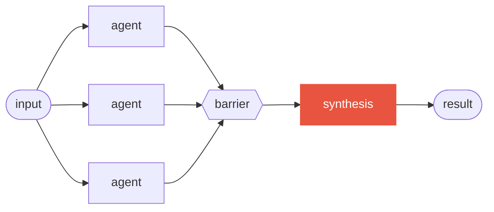
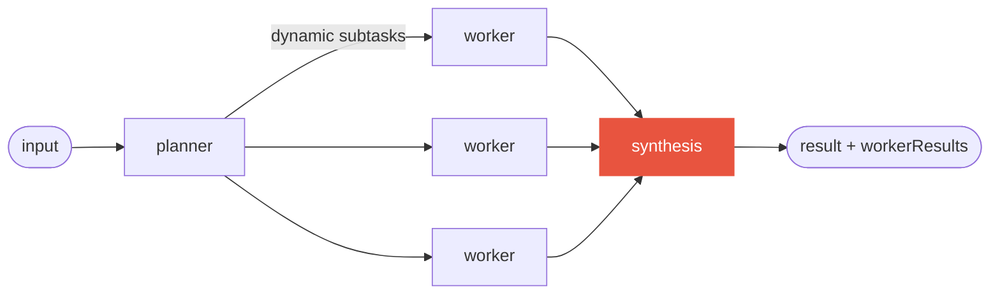

<h1 align="center">
  
</h1>

## The problem

Claude Code ships a **Workflow tool** (research preview): instead of one long
conversation doing everything, a plain JavaScript script orchestrates the
work — the loops, the conditionals, and the fan-out are deterministic code,
and only the leaf `agent()` calls think, each in its own fresh context
window. It scales from a handful of agents to hundreds.

But the tool is raw. Every workflow script re-invents the same machinery by
hand: fan-out followed by verification, loops with sane stop conditions,
schemas so results survive the trip back, honest accounting of what got
dropped or truncated. Hand-rolled, these break in the same subtle ways every
time — and an agent that died mid-thought looks exactly like one that
finished.

## The toolbox

Think of it as Lego. The Workflow tool is the **baseplate** — solid, but it
comes with no bricks. This repository adds:

- **Molded bricks** — `@workflow-toolbox` (`toolkit/`), a compile-time TypeScript library
  of seven tested orchestration patterns that snap together with ordinary
  `await` / `if` / `for`.
- **Instruction sheets** — Claude Code skills (`plugin/`) that teach Claude
  itself to author, scaffold, and debug workflow scripts.
- **Finished models** — runnable workflows committed as single-file `.js`
  artifacts under `toolkit/workflows/`; point the Workflow tool at one via
  `scriptPath` and it runs, no toolchain needed.

The two halves work together, but each stands alone: install the plugin and
never touch TypeScript, or use the toolkit from your own repo and never
install the plugin.

## When should I use a workflow?

Reach for a workflow when one long conversation is the wrong tool: the work
fans out (review N files, research M angles), needs independent verification
before you trust it, or is too big for a single context window. The script
makes the loops and fan-out **deterministic code**; only the leaf `agent()`
calls think. For a quick one-off question, a plain agent is still simpler —
a workflow earns its keep when structure or scale does.

## Prerequisites

**This plugin is free** ([PolyForm Noncommercial](LICENSE)). The only thing you
pay for is Claude Code itself — the **Workflow tool** is a Claude Code feature,
and the toolbox adds nothing to that bill.

- **Claude Code ≥ v2.1.154** with the Workflow tool. It ships as a research
  preview and is **not available on the free tier** — you need a paid Claude
  plan (Pro, Max, Team, or Enterprise) or Anthropic API access. On Pro, enable
  the *Dynamic workflows* row in `/config`; it is on by default on Max and Team;
  on Enterprise an admin enables it.
- **For the toolkit only** (authoring workflows in TypeScript): **Node ≥ 20**
  and **pnpm**. Plugin-only users need neither — the committed `.js` artifacts
  run as-is.

## Install the plugin

From the marketplace bundled in this repository:

```bash
# inside Claude Code
/plugin marketplace add home-dev-lab/workflow-toolbox
/plugin install workflow-toolbox@workflow-toolbox
```

Or from the CLI (add the marketplace first, then install):

```bash
claude plugin marketplace add home-dev-lab/workflow-toolbox
claude plugin install workflow-toolbox@workflow-toolbox
```

## Quickstart

**Try the ready-made review** — the repo ships a complete code-review
composition. From a clone of this repo, point the Workflow tool at its built
artifact via `scriptPath`:

```text
Run the workflow at ./toolkit/workflows/pr-review.js against the diff on main.
```

**Author your own** — describe what you want and the `workflow-composer` skill
takes over, or scaffold a skeleton with `/workflow-toolbox:toolkit-scaffold`.
The smallest workflow that actually runs is just a `meta` block plus one
`agent()` call:

```js
// hello.workflow.js — point the Workflow tool at it via scriptPath
export const meta = {
  name: 'hello',
  description: 'Minimal one-agent workflow',
  phases: [{ title: 'Greet' }],
}

phase('Greet')
const reply = await agent('Reply with a friendly one-line hello.', { label: 'greet' })
return { reply } // → e.g. { reply: "Hello! Hope your build is green today." }
```

Save it, then tell Claude Code to run it: *"Run the workflow at
`./hello.workflow.js`."* The Workflow tool executes the script, runs the single
agent in its own fresh context, and hands back the returned object.

**Author off-repo** — the three authoring packages are published to npm, so you
can compose workflows from any project without cloning this repo:

```bash
pnpm add -D @workflow-toolbox/runtime @workflow-toolbox/patterns @workflow-toolbox/build
```

Write a `*.workflow.ts` against `@workflow-toolbox/patterns` — and note the
`/define` subpath for `defineWorkflow` (the package-root re-export typechecks,
but `workflow-toolbox build` then fails with a `node:vm` resolve error):

```ts
import { defineWorkflow } from '@workflow-toolbox/build/define'
import { fanOutAndSynthesize } from '@workflow-toolbox/patterns'
```

The full loop runs off-repo through the published `workflow-toolbox` CLI: `npx workflow-toolbox scaffold
spec.json` for a build-clean skeleton, `npx workflow-toolbox build my-flow.workflow.ts
--typecheck` to emit the sandbox-compliant artifact, `npx workflow-toolbox check` to lint it,
then — after a run — `npx workflow-toolbox debug` / `npx workflow-toolbox report` to diagnose or audit it.
One convention to know: `workflow-toolbox build` names the artifact from the workflow's
`meta.name`, **not** the entry filename — it writes `workflows/<meta.name>.js`,
so the follow-up is `npx workflow-toolbox check workflows/<name>.js`.

**When a run misbehaves** — an agent that finished with nothing, a schema that
kept retrying — point the `workflow-debugger` skill at the run's journal to see
what happened and whether resuming is safe.

## What the plugin ships

| Component | What it does | How it's invoked |
|-----------|--------------|------------------|
| `skills/workflow-composer` | **Author** runnable workflow scripts: the file format, the `pipeline` vs `parallel` judgment call, schemas, determinism rules, a standalone linter, 3 starter templates, worked examples — with the `@workflow-toolbox` toolkit as its standard library for repeatable workflows. | Automatically when a request matches, or `/workflow-toolbox:workflow-composer` |
| `skills/toolkit-scaffold` | **Start** a new composition: generates a build-clean `.workflow.ts` skeleton wired to the chosen `@workflow-toolbox` pattern, so you fill in prompts instead of boilerplate. | Automatically, or `/workflow-toolbox:toolkit-scaffold` |
| `skills/workflow-debugger` | **Diagnose** a finished or failed run from its journal: why an agent died, whether schema retries fired, whether resuming is safe. | Automatically, or `/workflow-toolbox:workflow-debugger` |
| `skills/upgrade-canary` | **Re-verify** the Workflow runtime still behaves the way the toolkit depends on after a Claude Code (or SDK) upgrade, and report what changed. | Automatically, or `/workflow-toolbox:upgrade-canary` |

## The toolkit

`toolkit/` is a pnpm workspace of three core packages:

- **`@workflow-toolbox/runtime`** — typed declarations of the workflow sandbox surface,
  plus a `FakeRuntime` for deterministic tests. The only coupling point to
  Claude Code.
- **`@workflow-toolbox/patterns`** — the seven patterns (`classifyAndAct`,
  `fanOutAndSynthesize`, `adversarialVerification`, `generateAndFilter`,
  `tournament`, `loopUntilDone`, `planAndExecute`), each returning a result
  envelope with stats, warnings, and a replayable audit trail.
- **`@workflow-toolbox/build`** — the `workflow-toolbox` CLI plus `defineWorkflow`, which workflow
  entries import from the **`@workflow-toolbox/build/define`** subpath (the package
  root re-exports it too, but that import — while it typechecks — makes
  `workflow-toolbox build` fail with a `node:vm` resolve error). The CLI compiles a
  TypeScript composition into one self-contained `.js` the Workflow tool runs
  directly.

Four example compositions live in `toolkit/examples/`; their built artifacts
(12–36 KB each) are committed under `toolkit/workflows/` and run as-is via
`scriptPath` — no install, no build. Start with
[toolkit/README.md](toolkit/README.md).

### The seven patterns at a glance

Each pattern is a plain typed function: it takes the runtime and an options
object, spawns the agents shown below, and returns a result envelope with
stats, warnings, and a replayable audit trail. The
[pattern table in the toolkit README](toolkit/README.md) says when to use
each one — and when not to.

**`classifyAndAct`** — routing: one classifier picks the category, exactly one
handler runs.


**`fanOutAndSynthesize`** — parallel sectioning with a synthesis barrier:
independent agents run concurrently; synthesis fires only once every result
is in.



**`adversarialVerification`** — refute-first voting: every claim faces
independent verifiers prompted to break it; what fails the vote is kept and
flagged, never silently dropped.


**`generateAndFilter`** — generate wide, filter against explicit criteria in a
single pass; rejects are logged live and derivable from the envelope stats,
never silent.


**`tournament`** — several attempts from genuinely different angles, a judge
panel scores them, and synthesis takes the winner plus the best ideas from
the runners-up.


**`loopUntilDone`** — evaluator-optimizer iteration with a *typed* stop
condition — `done` / `maxIterations` / `dryRounds` / `budgetFloor`; omitting
it is a compile error, and the result reports which one stopped the loop.


**`planAndExecute`** — orchestrator-workers: a planner decomposes work that
can't be predicted up front, workers execute the subtasks, and synthesis gets
every worker's result.



## Heads up: the Workflow tool is a research preview

Everything in this repo targets Claude Code's **Workflow tool** (see
[Prerequisites](#prerequisites) for versions and plans). Part of the surface
this toolbox relies on is documented only by verification against the binary —
the reference docs mark every such fact — and a Claude Code upgrade may change
it without notice. Re-verify after upgrades (the `upgrade-canary` skill does
exactly this) before trusting a workflow in anger.

## Develop & test locally

The plugin source lives entirely under `plugin/`. Load it for a single session
without installing anything:

```bash
claude --plugin-dir ./plugin
```

Claude Code picks up the skills, and edits to a `SKILL.md` take effect
immediately in the session (other component types need `/reload-plugins`).

Validate before committing:

```bash
claude plugin validate .        --strict   # marketplace manifest (repo root)
claude plugin validate ./plugin --strict   # plugin manifest
node plugin/skills/workflow-composer/scripts/validate-workflow.mjs \
     toolkit/workflows/pr-review.js  # workflow linter (one file per run)
```

The toolkit has its own loop (Node ≥ 20, pnpm):

```bash
cd toolkit
pnpm install
pnpm test && pnpm typecheck && pnpm lint
```

## Repository layout

```text
workflow-toolbox/
├── .claude-plugin/
│   └── marketplace.json        # marketplace manifest — source: ./plugin
├── plugin/                     # ← the shipped Claude Code plugin
│   ├── .claude-plugin/
│   │   └── plugin.json         # plugin manifest
│   └── skills/
│       ├── workflow-composer/
│       ├── toolkit-scaffold/
│       ├── workflow-debugger/
│       └── upgrade-canary/
├── toolkit/                    # ← @workflow-toolbox, the compile-time pattern library
│   ├── packages/
│   │   ├── build/              # @workflow-toolbox/build    — defineWorkflow (./define) + the workflow-toolbox CLI
│   │   ├── debugger/           # @workflow-toolbox/debugger — run diagnosis + audit report (private; bundled into the CLI)
│   │   ├── patterns/           # @workflow-toolbox/patterns — the 7 patterns + envelope
│   │   ├── runtime/            # @workflow-toolbox/runtime  — sandbox typings + FakeRuntime
│   │   ├── scaffold/           # @workflow-toolbox/scaffold — .workflow.ts skeleton emitter (private; bundled into the CLI)
│   │   ├── smoke/              # @workflow-toolbox/smoke    — headless upgrade-canary harness (private; maintainer-only)
│   │   └── std/                # @workflow-toolbox/std      — zero-dep narrowing helpers (private; bundled)
│   ├── examples/               # 4 teaching compositions (*.workflow.ts)
│   └── workflows/              # committed build artifacts — runnable as-is
├── docs/
│   └── public/                 # architecture, known issues, ADRs
└── README.md
```

`plugin.json` pins a semver `version` — marketplace installs only see changes
when it is bumped, so bump it on every release-worthy commit. Local development
doesn't care: `--plugin-dir ./plugin` always loads the working tree as-is.

## Glossary

A few terms recur across these docs:

- **`agent()`** — a single leaf call that thinks in its own fresh context and
  returns text (or a schema-validated object). The only part of a workflow that
  uses the model.
- **Fresh context** — each `agent()` starts without the launching conversation
  in view. It still loads your `CLAUDE.md` and memory; it does not see the
  script's variables or prior turns, so pass it everything it needs explicitly.
- **`phase()`** — a label that groups the agents that follow it, for progress
  display and the audit trail.
- **`pipeline` vs `parallel`** — two fan-out shapes. `parallel` waits for every
  agent before continuing (a **barrier**); `pipeline` streams each item through
  its stages independently, no barrier.
- **Barrier** — a synchronization point where execution waits for all parallel
  agents to finish before the next step runs.
- **Schema** — a JSON Schema attached to an `agent()` call; the runtime forces
  the agent to return matching structured data and retries on mismatch.
- **Envelope** — the result object every `@workflow-toolbox` pattern returns: the data plus
  `stats`, `warnings`, and a replayable audit **trail** of what each agent did.
- **Journal** — the runtime's per-run record (`.claude/workflows/wf_<id>.json`)
  used for resume and post-hoc debugging.
- **Runtime** — the Workflow-tool sandbox surface (`agent`, `parallel`,
  `pipeline`, `budget`, …) that the script runs against; `@workflow-toolbox/runtime` is the
  toolkit's typed declaration of it.

## Learn more

- [toolkit/README.md](toolkit/README.md) — the authoring contract, the
  pattern table, composition rules, the result envelope.
- [docs/public/architecture.md](docs/public/architecture.md) — the full
  architecture: principles, the evidence-tiered runtime facts, guardrails,
  what was deliberately not built.
- [docs/public/known-issues.md](docs/public/known-issues.md) — open items and
  external limitations, honestly stated.
- [docs/public/adr/](docs/public/adr/) — the five architecture decision
  records.

## Privacy & security

This plugin collects no user data, has no telemetry, and transmits nothing about
you or your conversations. Everything runs locally against files Claude Code
already writes; the only outbound connection is the `upgrade-canary`'s
best-effort fetch of the public Claude Code changelog. See [PRIVACY.md](PRIVACY.md)
for the per-component breakdown and [SECURITY.md](SECURITY.md) to report a
vulnerability.

## License

[PolyForm Noncommercial 1.0.0](LICENSE): free to use, modify, and share for
any noncommercial purpose — personal projects, research, education, and
noncommercial organizations. Commercial use requires a separate license — see
[COMMERCIAL-LICENSE.md](COMMERCIAL-LICENSE.md).

## Credits

The `workflow-composer` skill was originally inspired by
[claude-code-workflow-creator](https://github.com/ray-amjad/claude-code-workflow-creator)
by [Ray Amjad](https://www.youtube.com/@RAmjad). The current corpus is an
original rewrite — see `plugin/skills/workflow-composer/README.md`.
